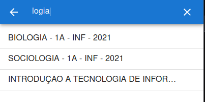
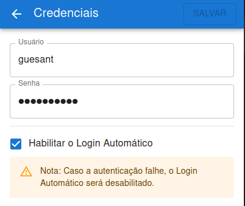
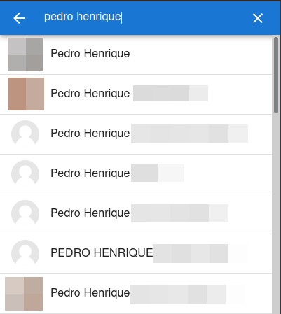

# improved-moodle

Extensão para navegador criada para melhorar a experiência do usuário na plataforma Moodle

## Instalação

Em breve.

## Funcionalidades

### Cursos

| Feature                              | Captura de Tela                                      |
| ------------------------------------ | ---------------------------------------------------- |
| Listagem dos Cursos Inscritos        |                |
| Busca por Curso                      |          |
| Fixar Cursos                         |        |
| Ordenar por Nome e por Último Acesso |  |

### Credenciais

| Feature          | Captura de Tela                          |
| ---------------- | ---------------------------------------- |
| Login Automático |  |

### Chats

| Feature        | Captura de Tela                    |
| -------------- | ---------------------------------- |
| Lista de Chats |        |
| Busca por Chat |  |
| Conversa       |   |

### Notificações

| Feature       | Captura de Tela                                     |
| ------------- | --------------------------------------------------- |
| Nova Mensagem |  |

## Aviso

- A utilização da extensão é de inteira e total responsabilidade do utilizador.

- Eu não me responsabilizo pelas consequências da utilização dos serviços e/ou da extensão.

## Hackeando

- Para baixar o código do projeto, digite:

```sh
git clone https://github.com/guesant/improved-moodle.git
cd improved-moodle
```

- Instalação das dependências:

```sh
# Com yarn (recomendado)
yarn
# Com npm
npm install
```

- Scripts de desenvolvimento

```sh
# geram assets e scripts em modo reload
# o conteúdo fica no diretório dist/ext
yarn dev

# formata os arquivos
yarn format

# analisa o código (checa os erros de typescript e eslint)
yarn lint

# os testes são feitos com o jest
yarn test
```

- Scripts de produção

```sh
# é gerado a pasta dist/ext e o zip da extensão
yarn build
```

### Estrutura do Projeto

- `src/helpers`

- `src/services`

- `src/assets/manifest.json`

  > A alma da extensão.

  Links úteis:

  - https://developer.mozilla.org/en-US/docs/Mozilla/Add-ons/WebExtensions/manifest.json

- `src/BackgroundScript`

  > Script que estará executando em segundo plano.

- `src/BrowserAction`

  > Página do popup que é aberto quando for clicado no ícone da extensão.

- `src/ContentScript`

  > Script que será executado em cada página (desde que esteja autorizado pelo manifest.json) que for aberta.

## Licença

[Gabriel R. Antunes](https://github.com/guesant) e [Contribuidores](https://github.com/guesant/improved-moodle/graphs/contributors) © [MIT](./LICENSE)
